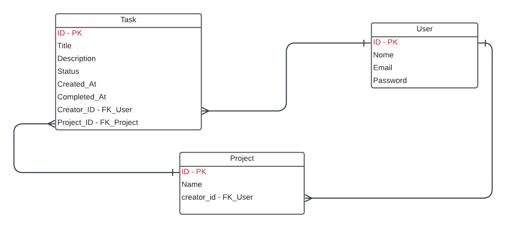

# API de Gerenciamento de Tarefas

## Introdução

Esta é uma API para gerenciamento de tarefas, desenvolvida utilizando o framework Laravel e PHP 8.1. e banco de dados Postgres para persistência dos dados. Este projeto foi escrito baseado nos principais conceitos do SOLID como os principios da responsabilidade unica, aberto e fechado e injeção de depêndencias. Com intuito de escrever um código limpo e desacolplado, esta api foi dividia em camasdas de Serviço, para tratar as regras de négocio, uma camada de repositório para tratar a persistência dos dados, Domínio, para abastração dos négocios e uma camada de Controller para tratar as requisições .

## MER - Modelo Entidade Relacionamento

- Modelo Entidade-Relacionamento (MER) do sistema é composto por três principais entidades: Users, Projects e Tasks, que possuem os seguintes relacionamentos:

### Users (Usuários): Representam os usuários do sistema, armazenando informações como nome, email (único) e senha. A tabela também inclui campos para verificação de email e tokens de autenticação.

### Projects (Projetos): Cada projeto possui um título, uma descrição opcional e é criado por um usuário (relacionamento com a tabela Users). A deleção de um usuário resulta na deleção de seus projetos associados.

### Tasks (Tarefas): Representam tarefas associadas a projetos. Cada tarefa tem um título, descrição opcional, status (PENDING, IN_PROGRESS ou DONE), data de criação e conclusão (opcional). Cada tarefa é vinculada a um criador (relacionamento com Users) e a um projeto (relacionamento com Projects). A deleção de um usuário ou projeto também exclui suas tarefas associadas.

Esse modelo organiza as tarefas e projetos em um contexto colaborativo, onde usuários gerenciam projetos e suas respectivas tarefas, permitindo controle sobre as dependências e integridade referencial.



## Como rodar o projeto

#### Clone o projeto
```bash
git clone https://github.com/thiagotfsilva/MANAGER_TASK.git
```

#### Usando docker compose para o banco de dados
```bash
docker compose up -d
```

#### Entre no projeto
```bash
cd MANAGER-TASk
```

#### Instale as depedências
```bash
composer install
```
#### Rode as migrações
```bash
php artisan migrate
```
#### Inicie o servidor
```bash
php artisan serve
```

